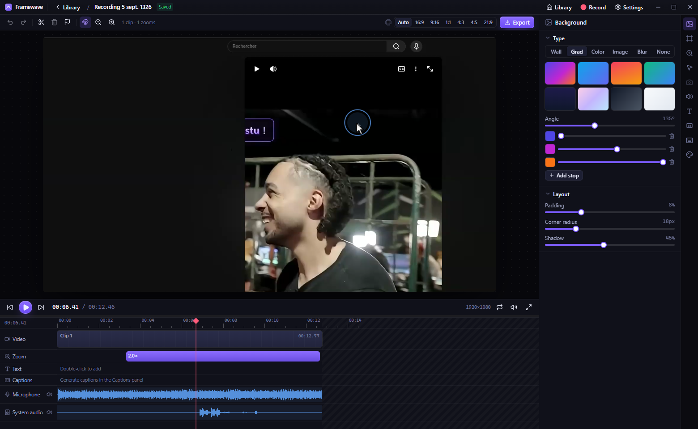

# Framewave

A powerful, local-first screen recorder and video editor for Windows — in the spirit of Cap / Screen Studio, with more control over the result. Everything runs on your machine: recording, editing, AI captions and export.



## Features

**Recording**
- Record a full display, a single window, or a drawn area (with size presets)
- Webcam and microphone, plus Windows system audio (loopback)
- 30 / 60 fps, three quality tiers, optional countdown
- Global hotkeys (`Ctrl+Shift+R` start/stop, `Ctrl+Shift+P` pause)
- Floating control bar and camera bubble that are **excluded from the capture**
- Cursor, click, scroll and keystroke tracking (global hooks)
- The real Windows cursor is hidden during recording and re-drawn in the editor, so it is always crisp and smooth (with I-beam / hand / resize shapes)
- Pause / resume with perfectly aligned events

**Editor**
- Automatic zoom generated from clicks and typing; spring easing, dead-zone cursor follow, adjustable sensitivity, per-segment focus & scale
- Smooth (Gaussian-filtered) cursor with click ripple / pulse / spotlight effects, motion trail, idle fade, tint
- Backgrounds: gradients with editable stops, curated wallpapers, solid colors, images, blurred-screen, or transparent
- Padding, corner radius, shadow, border, crop, color grading, vignette
- Aspect presets (16:9, 9:16, 1:1, 4:5, 4:3, 21:9) and 720p → 4K output
- Camera overlay: circle / squircle / rounded / square, position (drag on the preview), mirror, border, shadow, zoom; timeline segments to hide it or go fullscreen
- Keystroke overlay (pills or keycaps), shortcuts-only mode for privacy
- Timeline: trim, split, delete ranges, in/out points, per-clip speed, markers, snapping, waveforms
- Text overlays with animations (pop, fade, slide, typewriter) and presets (title, lower third, badge, note)
- Audio: per-track volume, mute, noise gate, fades, background music with loop, **one-click silence removal**
- **AI captions** with Whisper running locally (WebGPU / WASM), SRT/VTT import & export, karaoke-style word highlight
- Undo / redo, autosave, keyboard shortcuts

**Montage (multi-clip editing)**
- Create a project from several videos and photos, or add media to any project (button, drag-and-drop)
- Reorder clips by dragging, trim, split, per-clip speed, volume and mute, fill/fit framing for mixed aspect ratios
- Transitions between clips: cross fade, dip to black/white, slides, wipe, zoom, blur — with audio crossfade
- Background music with loop and fade-out, exported together with each clip's own audio

**Export**
- MP4 (H.264 / H.265 / AV1), WebM (VP9, alpha-capable), GIF, PNG sequence, MP3
- GPU-accelerated via WebCodecs — typically many times faster than real time
- 24 / 30 / 60 fps, 480p → 2160p, quality presets, range export

## Development

```bash
npm install
npm run dev          # launches Electron with hot reload (add -- -w to also restart on main-process changes)
npm run typecheck
npm run build        # production build to out/
npm run dist         # Windows installer + portable exe in release/
npx electron-builder --mac   # on a Mac: .dmg / .zip (arm64 + x64) in release/
```

CI (`.github/workflows/build.yml`) builds Windows and macOS packages on every push to `main` and attaches them to a GitHub Release when a `v*` tag is pushed. The macOS build is ad-hoc signed (no Apple Developer certificate): open it once with right-click → Open, or System Settings → Privacy & Security → Open Anyway. If macOS still says the app is damaged, run `xattr -cr /Applications/Framewave.app`.

Set `FW_DEBUG_PORT=9333` before `npm run dev` to expose the Chrome DevTools protocol for automation.

## Architecture

```
src/
  shared/types.ts        data model (Project, Timeline, RenderSettings, events)
  main/                  Electron main: windows, IPC, media protocol with range support,
                         project storage, ffmpeg wrapper, global input tracker (uiohook + Win32 via koffi)
  preload/               typed bridge exposed as window.fw
  renderer/src/
    engine/              compositor (canvas), zoom solver, cursor rendering, layout, background,
                         timeline math, multi-track player, audio mixdown, transcription
    export/              WebCodecs exporter (mediabunny) + ffmpeg post-processing
    recorder/            MediaRecorder-based recording engine
    components/          React UI (home, recorder, editor, inspector panels, export dialog)
    store/               zustand stores
```

Recordings are stored as folders under `Videos/Framewave/<project>/` containing the media files, `events.json` (cursor/click/key data) and `project.json` (the edit). Nothing is uploaded anywhere.

## Notes

- Requires Windows 10 2004+ for capture-excluded overlay windows; works on Windows 11.
- macOS: editing, montage and export work as-is. Recording works with Chromium's screen/camera capture (grant Screen Recording, Camera, Microphone and Accessibility in System Settings); system-audio loopback and cursor hiding/shape are Windows-only for now.
- The Whisper model (≈40–250 MB depending on size) is downloaded from Hugging Face on first use and cached locally.
- If the app is force-killed while recording, the system cursor is restored the next time it starts.
